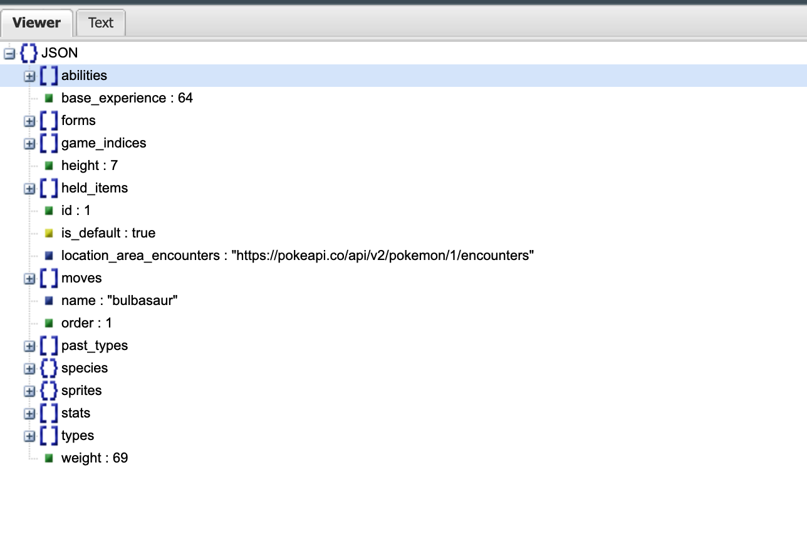

# Pokemon CLI Application

This Python CLI application interacts with the Pokemon API to fetch Pokemon data. It allows you to fetch data for a specific Pokemon using its ID or retrieve data for the first 20 Pokemon by default if no ID is provided. However, in total there are 1292 but fetch all of them leads to very slow response. The application also supports saving the data to a user-defined directory, partitioned by date and time, and using flag it storing the data in a PostgreSQL database.

I got the better understanding of JSON response using the Json visualiser. As only first level information was requested. 




## Project Tree 

The code is distributed in to three python files. All API related work is in `API.py`. All database realted interaction and ingestions are in `postgres_db.py`. The `main.py` file is used to receive CLI based commands and orchestrate the functionalities in this micro applicaiton.

    ├── API.py
    ├── Data Platform Engineer - Case Study.pdf
    ├── Dockerfile
    ├── docker-compose.yml
    ├── main.py
    ├── postgres_db.py
    ├── readme.md
    └── requirements.txt

## Table of Contents

- [Prerequisites](#prerequisites)
- [Installation](#installation)
- [Usage](#usage)
- [Docker Compose](#docker-compose)
- [Command-Line Arguments](#command-line-arguments)
- [Examples](#examples)
- [Data Storage](#data-storage)

## Prerequisites

Before using this application, you need to have the following prerequisites:

- Python 3.11 or higher installed
- Docker and Docker Compose for running the application in a container
- PostgreSQL server for database storage. 

## Installation

2. Create a Python conda environment:

   ```bash
   conda create -n pokemon_env python=3.11
   conda activate pokemon_env
   ```

3. Install the required Python packages:

   ```bash
   pip install -r requirements.txt
   ```

4. Set up a PostgreSQL database and configure the connection details in your Python script (`main.py`).

## Usage

Run the Python CLI application as follows:

```bash
python main.py --help
```

### Command-Line Arguments

- `--id Text`: Fetch data for a specific Pokemon by ID. If not provided 
- `--save_dir TEXT`: Specify the directory to save the data. The data will be partitioned by date and time.
- `--db Flag`: The Flag to enable PostgreSQL database integration

### Examples

- Fetch data for Pikachu (ID = 25) and save it to a directory named "pokemon_data":

  ```bash
  python main.py --id 25 --save_dir pokemon_data
  ```

- Fetch data for the first 50 Pokemon and save it to a directory named "pokemon_data":

  ```bash
  python main.py --save_dir pokemon_data
  ```

- Fetch data for Pikachu (ID = 25) and store it in the PostgreSQL database:

  ```bash
  python main.py --id 25 --db 
  ```

## Docker Compose

You can run the application inside a Docker container using Docker Compose. Ensure that you have Docker and Docker Compose installed.

1. Build and Run the Docker image in the container:

   ```bash
   docker-compose up --build
   ```


3. Open a new terminal and run the following commands :

   ```bash
   docker exec -it python_container /bin/bash
   
   python main.py --id 25 --save_dir pokemon_data

   python main.py --save_dir pokemon_data

   python main.py --id 25 --db 
   ```

## Data Storage

The application stores fetched data in a user-defined directory partitioned by date and time. Each execution generates a new JSON file with a timestamp as the filename.

Data can also be stored in a PostgreSQL database with the "pokeapi" schema and "pokemondata" table.
